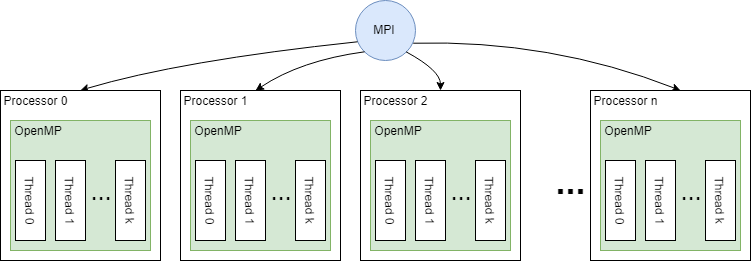
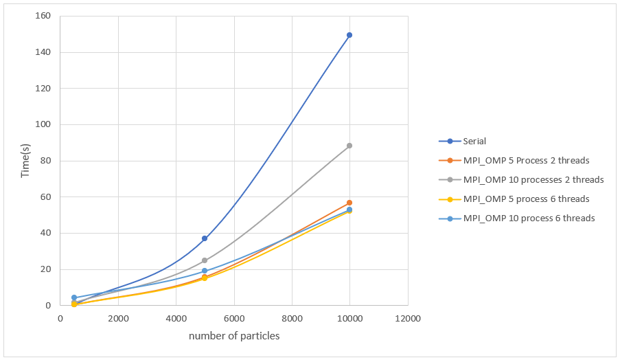
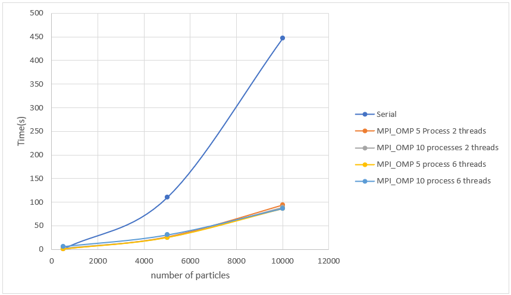
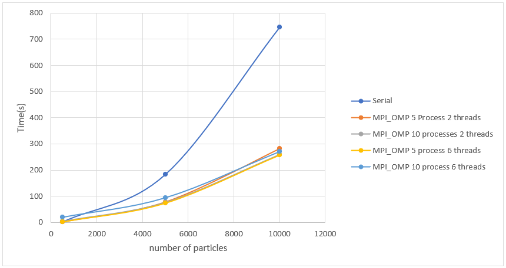

## N-Body Problem 
**Language used: C++**
1. [Overall Description](#descript)
2. [Performance comparison](#performance)
3. [How to run](#run)

<a name="descript"></a>
### Overall description
A serial and Parallel implementation of the [N-body problem](https://en.wikipedia.org/wiki/N-body_problem). 
The parallel version was implemented using a combination of MPI and OpenMP. Intuition: Each processor of the MPI framework uses OpenMP to spawn multiple threads and improve its local runtime.


<a name="performance"></a>
### Perfomance comparison
The following graphs represents different configuration of MPI-OpenMP implementation Vs the serial implementation.

- For T = 60, delta_t=1s


- For T = 100, delta_t=1s


- For T = 300, delta_t=1s


As we can observe, for our trials, the configuration 5 MPI processors and 6 OpenMP threads outperform the other parallel configurations and the serial implementation. 

<a name="run"></a>
### How to run
- Generate random set of bodies (with velocity and mass) using data_generator.cpp
- Compile and build the N-Body Serial project using: 
```
g++ -Wall -lstdc++ -std=c++11 -lm main.cpp n_body.cpp n_body.h -o main_serial
```
- Compile and build the N-Body MPI-OpenMP project using:
```
mpicc -lstdc++ -std=c++11 -qopenmp main.cpp n_body.cpp n_body.h -o main_parallel
```
